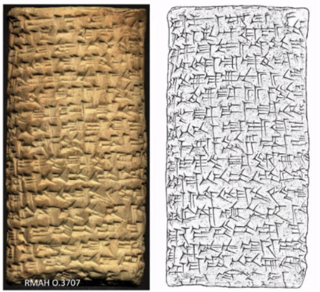

<!-- Output copied to clipboard! -->

<!-- You have some errors, warnings, or alerts. If you are using reckless mode, turn it off to see inline alerts.
* ERRORs: 0
* WARNINGs: 0
* ALERTS: 1 -->

>>>>>  gd2md-html alert:  ERRORs: 0; WARNINGs: 0; ALERTS: 1.

<ul style="color: red; font-weight: bold"><li>See top comment block for details on ERRORs and WARNINGs. <li>In the converted Markdown or HTML, search for inline alerts that start with >>>>>  gd2md-html alert:  for specific instances that need correction.</ul>

Links to alert messages:
<a href="#gdcalert1">alert1</a>

>>>>> PLEASE check and correct alert issues and delete this message and the inline alerts.

# Tuesday Group 1

[Back to program](https://docs.google.com/document/d/1IdiIwnQaMAUXxAvFm_pczsXROweZ9Mqr3p5mDot8Lxk/edit?usp=sharing)

Imaging with Multi-Light Reflectance dome methods (Hameeuw)

Meta consideration when humanities and technical sciences work together: walk the rope between the humanist interests and the technical interests.

How to preserve the 3D data (3.4 GB per tablet raw data, reduced final data 46 MB)? They have developed in-house compression software to compress registered stack of data (see Q&A for this keynote). All info is there and one can go back to recreate the 3D model. There are publicly available software for compression on github.

Data economy still important, despite large storage capacity. Network capacity is limiting factor.

Uses:

1. Documentation (conservation, curation)
2. Research (philological, art historical
3. Online repos, dissemination
4. Data mining, machine learning

There are already many thousands of dome-scanned tablets.

It is interesting that there are are already several scanned of a tablet in different time frames.

They have developed lots of viewing interfaces →  CHI (S. Francisco based) and Italian group will update interfaces so that these can run properly on current OS.

RTIViewers are in development. 

Processing methods: 1) PTM processing 2) HSH-RTI processing 3) PLD processing

Advanced Capture Methods → Capture with PLD systems: better to use UV light ( = shorter waves) than red and normal white light.

3D techniques produce pictures that are deceptively like line-drawings as Assyriologists know them. Important to communicate the difference to users.

Quality assessments for 3D data is work-in-progress.

Requirement for infrastructure: viewers must support multiple ways/algos for reducing tablets to 3D data, because different algos have different strengths and weaknesses, and researchers must be able to choose case-by-case.

Possibility to capture also using different light (for example ultraviolet), allowing to focus on different factors

Integrated approach: a system with multiple viewers on the same (raw/original) data.

For data compression, what software is being used? Publicly available?

Answer: yes, in house developed, but open source on GitHub.

