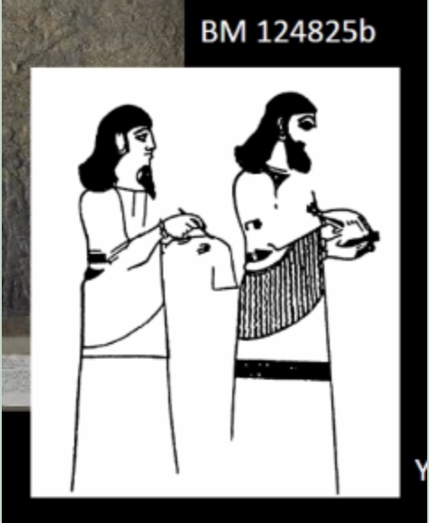

# Tuesday keynotes

# **Keynote 1m**: Sign, fingerprint and handwriting recognition in digital cuneiform projects (Mara)

Gigamesh: [https://www.gigamesh.eu/?page=home](https://www.gigamesh.eu/?page=home) 

Multiscale scanning. d = 0.2mm for seeing fingerprints.

Surface segmentation to reveal tool marks.

From observations to “symbolic” analysis (spatial n-grams of wedge constellations).

Clustering.

Univ. Jena scanned 2000 tablets.

Automatic Generated Metadata (NFDI infrastructure for 

Heidelberg Cuneiform Benchmark Database

What kind of search interface does it offer? 

Answer: heatmaps of clusters of wedges. Not yet a combination of an ATF pattern and wedge data.

Hendrik: can wedges/lines be annotated symbolically?

Answer: with the help of manual annotation, still labor-intensive. (Gottsteincode)

Study of paleography (writing system over time).

Theoretically, we could observe whether the stylus has changed dimensions over time.

Cuneiform recognition so far works with training sets, manually crafted. Is this an alternative?

That’s a holy grail, but a few years down the line still.

===

Overview: Computer Scientist working on archeology and cuneiform tablets. Talk about tablets and other 3D objects (Egypt., Rom. encryptions).

GigaMesh (gigamesh.eu) in Archaeology: popular in Archeology. In Assyriology: 3D spherical object -> sphere fitting used for unwrapping. 

MSII (Multi Scale Integral Invariant) : extend sphere approach and extend it to multiscale.(d=.2mm ridge/valley). \
Are there intentional fingerprints?

Sphere-Surface Convolution: archeologists wanted to see intersections: fourier analysis to find similar patterns.

Spotting of grouping of cuneiforms by using 2-grams or n-grams = number of pairs of letters you can use → dictionary of spatial n-grams→ you can build a processing pipeline like a graphic search engine for cuneiform symbols.

Datasets: object orientation & Mesh Inspection

Technical Metadata & NFDI: how to collect data and prepare it to be meaningful to others? 3D database: each object has an identifier that one can use in publications → used for Period Classification using Geometric Neural Nets (evaluated with metric “precision”: e.g. 84% = taking randomly a class you’d have precision of 84%). Using filters, it appears NN trained for preservation of surface

Outlook on MaiCuBeDa - Signs: cooperation with Timo Homburg and Kai-Chiristian Bruhn, Mainz.

gigamesh.eu

# **Keynote 2m**: Ink traces on clay tablets: an epigrapher’s testimony (Sonnevelt)

Bilingual society: Akkadian (writings in clay) and Aramaic (writing in ink, most of it lost, some incised in clay)

Two ways of writing portrayed in the same document: clay and ink

Missing so far: Aramaic writings from Babylonia.

Use of Aramaic is associated with traders and agri-companies, not with elite culture.

Functions of inked writings: descriptive metadata! Either as explanation or as summary, or an added comment.

* She detected some fingerprints on ostraca but these were not very clear

Challenges: 

* Blurring
* Fading
* Later notations
* staining

**Murphy’s Law:** if a curator stamps an unused part of an artefact, it WILL appear that the part was not unused after all. (inked writing underneath).

How did you get the idea to suspect Aramaic writing underneath the stamp of the archaeologist?

Answer: For database reasons. The tablets were singled out by specific search criteria.

Thank you for this great presentation.  Do you know other uses of pigments on clay cuneiform tablets, besides these Aramaic notations and the 3rd millennium samples analysed in the Following paper: Raman identification of cuneiform tablet pigments: emphasis and colour technology in ancient Mesopotamian mid-third millennium, [https://www.sciencedirect.com/science/article/pii/S2405844016319181](https://www.sciencedirect.com/science/article/pii/S2405844016319181)

Other question: are these tablets in CDLI, and is the aramaic included in the ATF?

Answer: yes, look for language=aramaic.

The reference numbers written by musea on the artefacts are invasive. Any new system applied to tablets currently excavated (or to other small objects)? 

# **Keynote 3m**: Methods to find faint traces of pigments and ink on archaeological objects (Alfeld)

Focus on photographic methods to explore archaeological objects.

Normally, to augment contrast one would perform 1) histogram equalizer 2) Dstretch.

Photography & DStretch (Decoloraton Stretch)

Hyperspectral methods (= for every pixel a spectrum)

X-Ray Fluorescence (XRF)

* measures point by point
* Surface sensitive
* XRF spectrometers to study antique (= most gone today) polychromy

Reflection Imaging Spectroscopy (RIS)

* measures via vertical line
* Shows traces of pigments beyond XRF

MA-XRF: more info about material (lead (not sure if this is the name of the material) (eyes), 

copper (hear), iron, ...)

**Conclusions**

* Advanced photographic documentation can reveal traces of well studied objects.
* RIS allows to reveal faint traces of pigments, beyond XRF in some cases and identify chemical compounds.
* XRF allows to visualize the distribution of elements at and below the surface.

Mesopotamian Sculpture in Colour, edited by Astrid Nunn and Heinrich Piening, PeWe-Verlag, Gladbeck, 2020 [https://journals.openedition.org/techne/2783](https://journals.openedition.org/techne/2783) 

Matthias also commented on the right order to conduct analyses:  XRF and X-ray microCT after thermoluminescence for dating. 

# **Keynote 1a**: Fingerprint analysis in archaeology & forensic investigation (De Jongh)

Team WOVI  fingerprint evidence: 

1. Visualization (=chemists moving on chemical technology to visualize latent fingerprints)
2. Photography (=capture & enhance fingermarks)
3. Comparison (WOVI, = compare fingermarks with reference prints with a standard protocol which includes three steps in forensic processing of fingermarks:
* Analysis
    * Anatomical source: could also be fingertips, finger joints, palms. They also question: is it a simultaneous placement of multiple fingers?
* Comparison. They look at:
    * general patterns (arches, loops and circular patterns)
    * size (small or large patterns)
    * core-delta distance = number of lines between them
    * direction, alignment, rotation
    * Minutiae (papillary ridges)
* Evaluation
    * When am I sure 2 fingerprints are from the same person? How many persons have this same pattern? The answer is formulated/estimated evidential value using a Bayesian framework  likelihood ratio (LR) which is expressed using a verbal scale.

Specific forensic questions:  Activity level casework: 

Hp1: mark was left when climbing balcony

Hp2: mark left during a visit to the apartment

Forensic experts look at how they would have left the print

**Q&A with the forensic experts**

Can the age of the person be determined from their fingerprints?

That’s a rare question (in forensic settings), and there is no forensic model that supports age conclusions. There is also no strong science behind it. In clear cases you can base it on the size of the finger (child vs adult).

Is the forensic fingerprint database representative for the population at large?

The database now covers three countries. Several features seem to be remarkably constant in frequency over different countries.

About photographs. What about 3D data? Is that being used in forensic fingerprint studies?

It is possible, but not much used. Sometimes used as extra illustration of specific circumstances.

The manner of imaging finger print might influence the count of minutiae.

In case of clay tablets, the imaging of fingerprints is very special indeed.

When we observe fingerprints on clay, they are often overlapping several times at different angles; would it be "readable"?

Yes, if the prints have a different enough direction (flow of the ridges).

Do you deal with movement of fingerprints?

Yes, distorted fingerprints are often seen. Those factors will be defined in advance (as much as possible). If identified, those prints will be excluded from analysis.

# **Keynote 2a**: Fingerprints: from Neolithic clay tokens to cuneiform tablets (Bennison - Chapman)

RTI on fingerprints from Boncuklu Hoyuk’s clay objects (“tokens”).

There are less prints on tablets than you generally find on non-tablet prehistoric pieces of clay.

Because tablets were usually smoothed before writing on them

This might be a question for another expert in the audience, but is it possible that CT scanning (or other techniques) might help mitigate the issue with ID numbers and nail polish?

Then you could read below the varnish layer.

Or use infrared light, will can do the same.

Or: optical coherence tomography. Ask Alfeld. Only to see through transparent materials. 

Do you have less prints for different genres which might have been created and smoothed more carefully

* Maybe more prints in (sloppier?) texts (school texts?)

School texts (Caroline)

The difference between finger/thumb prints and palm marks can be hard to establish.

Small palm marks and big fingerprints do occur.
