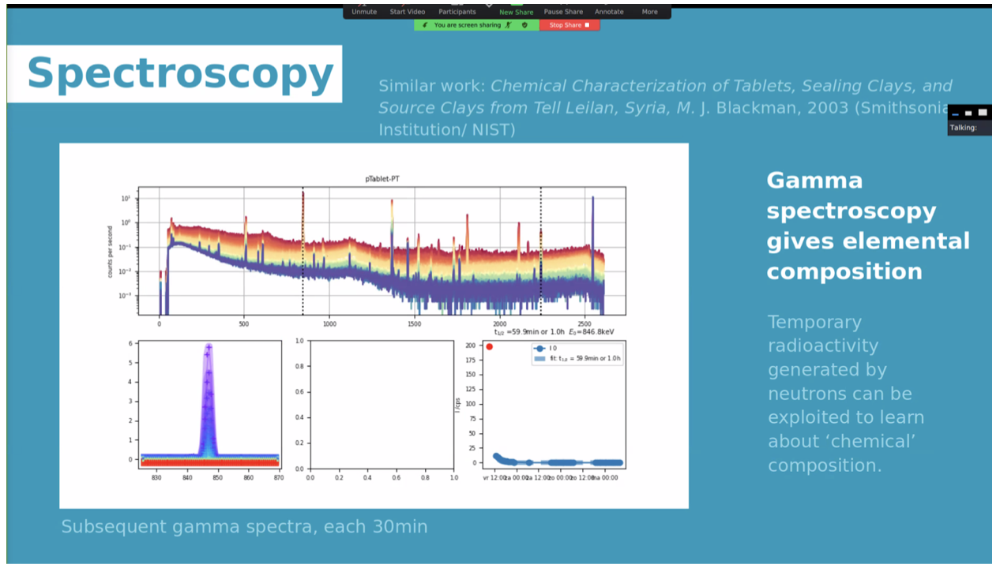
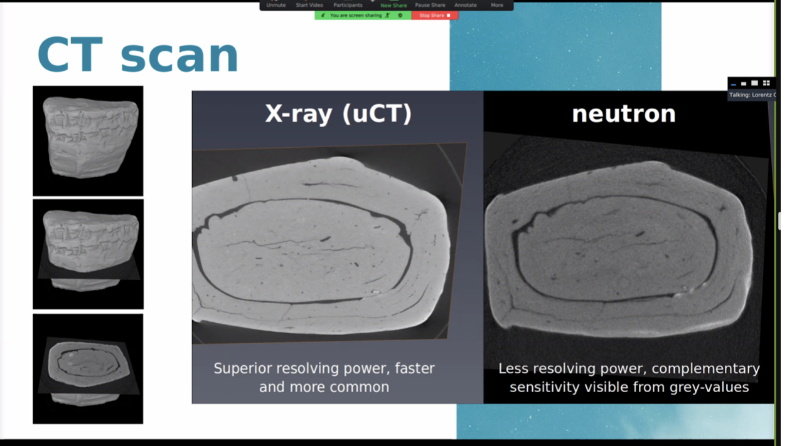

# Wednesday Group 1

Getting element-specific information from the pristine interior bulk of precious objects, non-invasively (Van Eijck)

Bertil: is it necessary to calibrate the elemental analyses?

Answer: we now how to calibrate in advance, the detector is already calibrated.

There is an object specific part: the absorption.

We calibrate by having an iterative routine (using a succession of measurements, and feeding it into the computer).

Bertil: How long will the object stay radioactive? Also asked by Viktor.

See: 

Answer: it depends on the isotopes that are present, can vary from several minutes to several hours to days to much longer. The radioactivity never becomes zero, but it stops carrying information after some days. .

There was a question by Hubert (which I missed).

Bertil : could you use rietveld analyses on the diffraction pattern when you put in the known minerals (in other word, is the resolution enough)?

Lambert: yes, I would argue to do Rietveld analysis indeed. Also here: I expect the challenge is the absorption correction to ensure you are fully quantitative. For identifying which structures you have, it’s not so crucial, but the absorption correction needs to be taken into account when properly determining the ratios.

Where does the hydrogen at the edges  comes from? 

Likely organic matter, but you cannot infer that from the measurement. You need to combine information.

(Lambert: we see this brightening also on bronzes; if it’s not hydrogenous materials that penetrate the outer layer (moisture, grease, ink?, paint), it is could also be corrosion. For bronzes I see chlorine in the gamma spectroscopy, which we will find back in gamma spectroscopy).

How robust is the diffraction under firing?

Pretty much, but it should be tested systematically.

Bertil: Certainly, iron is oxidized  to hematite, clay minerals will fuse and form other clay minerals according to temperature.

Lambert: The proof is in the tasting: put some clay powder in the diffractometer and measure while heating.

