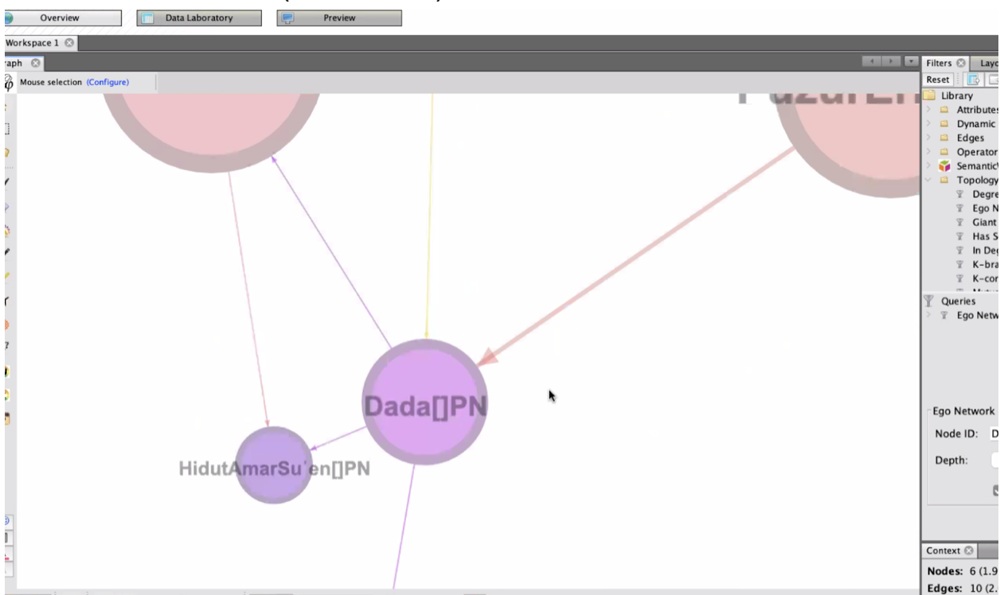
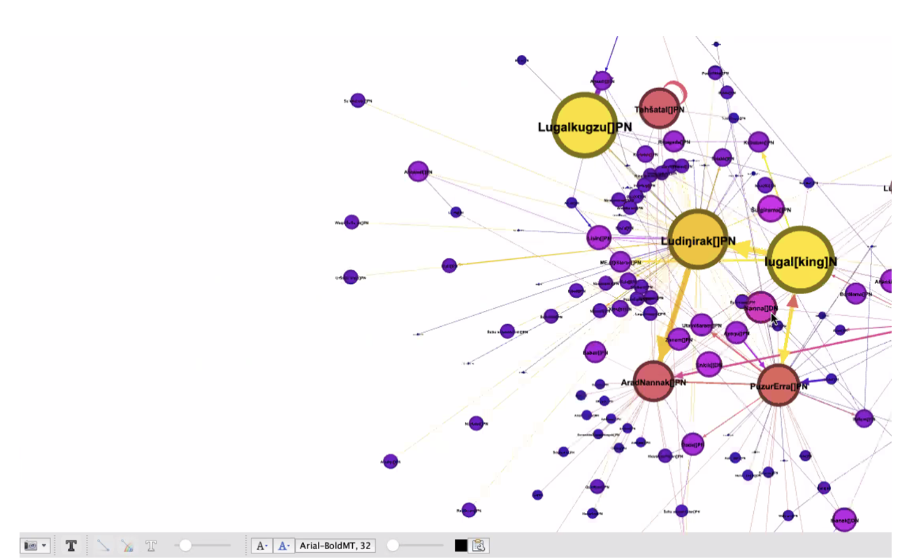
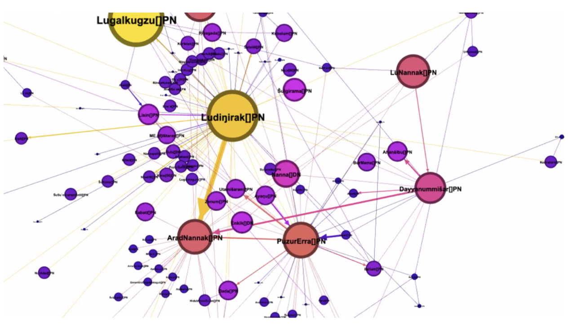

<!-- Output copied to clipboard! -->

# Wednesday afternoon Group 1

[Back to program](https://docs.google.com/document/d/1GOKwR2LbpfNVg7i21ojKSwvFZ5Ajzmi8cpF9yN1WXEQ/edit?usp=sharing)

Sumerian Networks: Linked Data Models from ORACC to Wikibase (Anderson)

[https://github.com/sumeriannetwork](https://github.com/sumeriannetwork)

[https://gephi.org](https://gephi.org)

[https://bids.berkeley.edu/publications/sumerian-networks-classifying-text-groups-drehem-archives](https://bids.berkeley.edu/publications/sumerian-networks-classifying-text-groups-drehem-archives)

Demo of Gephi using a downloaded graph data file from GitHub.

Adam’s Slides: [https://docs.google.com/presentation/d/1G_bdXx5nAZgusdPhFo2Ofjw6At3c_IIMgF2O_EFRWt0/edit?usp=sharing](https://docs.google.com/presentation/d/1G_bdXx5nAZgusdPhFo2Ofjw6At3c_IIMgF2O_EFRWt0/edit?usp=sharing)

Rients: Does the connectedness of “dada” show in your graph.

Answer: connectedness 5 (in this archive). But this is a subset of …

Hubert: can you remove the King? Yes.

Caroline: how interconnected are the archives (text-groups)?

Very!

Could you then look for the most central _archive_?

Yes.

That would be” domesticated animals”.

Question by Cale:

A question: have you been able to isolate „transaction“ or „event“ as a category in the Ur III tablets? For example, if a transaction/event appears in copies of the same tablet or the appearance of a single transaction in a summary tablet. This is a particularly rich theme in the Drehem tablet, I think.

Transactions span time, some tablets are about multiple transactions. This is tricky.

We are analyzing commodities over time. There is a chance that this connects the dots of transactions.

