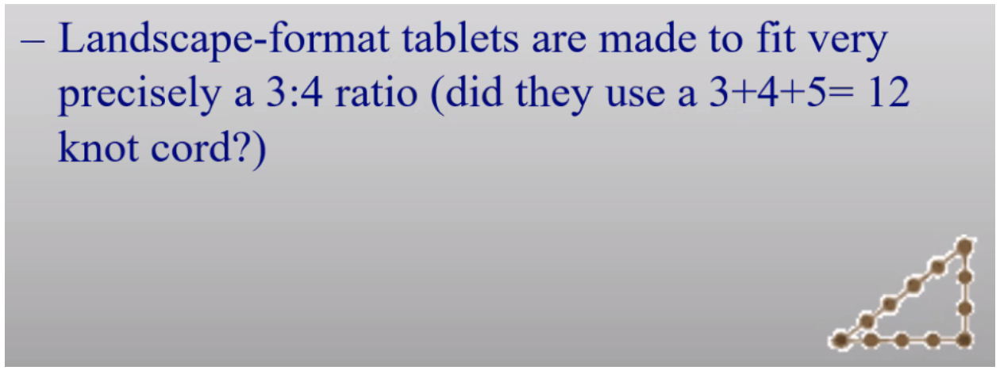

# Wednesday keynotes

# **Keynote 1m:** Provenance analysis of clay texts: state of the art and prospects (Stratford)

Recommendations for future XMRF activities

* endorse and use a single calibration source appropriate for ceramics 
* design projects with sensitivity to scientific, technical, archaeological and historical complexities

## Response by Van Os

Notes

quality of analysis depends highly on quality of samples

For calibration of machines -> use reference materials ([http://georem.mpch-mainz.gwdg.de/](https://eu01st1.zoom.us/web_client/zsc0psq/html/externalLinkPage.html?ref=http://georem.mpch-mainz.gwdg.de/))

Use maps of chemical composition of soil to generate an expectation of elements that will be found in analysis

Certain elements have interdependencies (for example if content of one rises, content of the other falls)

Some elements are more easily introduced later into the soil, while some are less “mobile”??

From Michela Spataro:

Thank you very much for this brilliant talk. I also agree with Bertil van Os'comments; in this case SEM-EDX analyses would be the ideal complementary technique, as with EDX you know (as you can see) exactly what you are analyzing, whether you are quantifying the clay or a non-plastic inclusion/grain  (however only for major and minor oxides). Reference material of known provenance (e.g. mudbrick, locally made pottery) is also essential.

Dear Bertil van Os, yes. We usually analyse 4-5 bulk areas (c. x100), and we look at the average and standard deviation. The tablets we analysed so far are very consistent throughout, there were most likely levigated (at least 16 out of 20). In this project, the SEM-EDX is complementary to the thin section polarized microscopy.

Bertil: Yes would be good to combine this with other methods like inaa, or use the outcome of the SEM-EDX to improve the p-XRFcalibration.

Taylor: the point about K being light and therefore not necessarily reliable bears on the issue between Goren and Uchida. Goren placed emphasis on K-Ti plots. Uchida’s results differed. He concluded that it was a product of the lack of calibration by Goren

Bertil: An alternative would be to use Rb-Ti plots instead of K-Ti plots. Rb behaves geochemically as K, and is measured upto a few millimeters in the sample. The detection limit for Rb for p-XRF is around 1 ppm. The  average content in clay varies between 50-150 ppm.

In the case above, although the K could be well calibrated, the irregular surface makes it impossible to perform a good  K analyses. 

Taylor: another issue I’ve heard raised (with reference to pXRF) is the use of ammonium chloride as a preparation for photography. Records were not kept of exactly which tablets that was used on. Sometimes it was done en masse. If that interferes with the results, whole collections / tablet corpora would be beyond use.

Bertil: Would not think this would interfere too much with XRF measurements. Only if applied as a thick coating. Chlorine ( in this case as chloride) is easily detected by pXRF, especially when using machines that can switch filters  during the measurements, such as the modern Niton and Olympus machines. Also ammoniumchloride which will easily dissolve could be removed by carefully applying water and absorbing paper (japanese rice paper).

Bertil: The Ni concentration in the NINO tablets you measured is high compared to values measured by Uchida for tablets from the same city. 

Hunt 2015 JAS ([http://dx.doi.org/10.1016/j.jas.2014.11.031](http://dx.doi.org/10.1016/j.jas.2014.11.031)) wrote: p-XRF results on Ni are more semi-quantitative than for other mid-range atomic numbers because of spectral overlap radiation of the Cu Ka line onto Ni Kb line and differences in filters used. Could this explain teh large difference observed?

Uchida has tablets with low Mn concentrations like the measured NINO tablets have. He also has higher values. I thought I took out his points with Manganese stains but I should double-check.  The Mn concentration in the NINO tablets you measured are always low. I think you avoided zones with stains. 

In general, would it be worth archiving together with the p-XRF data the photos showing where the p-XRF beam impacted the tablets to control the homogeneity of a zone? Possibly for data screening. Might also serve for preservation issues? The Mn stains result from bacterial activity and can develop in musea. Right?

 

# **Keynote 2m**: Clay tablets as containers of data on the palaeoenvironment (Watanabe et al.) 

Notes

# **Keynote 1a**: The organization of knowledge in the earliest cuneiform texts (Johnson)

Notes

Two types of data-security

* Outward-facing, transactional
* Inward-facing, audital

Mara: do the forms get more complicated over time?

Answer: sure. The complexity goes wild. There is also complexity over time. (Meat distributions for festivals).

Bertil: would the production of the two types be organized differently by different status people?

It has often been suggested that the clay bullae might more easily allow literate individuals / administrators to interact with non-literate individuals. One can certainly imagine that a herd manager might know the meaning of the tokens found within clay bullae (which refer to type and numbers of commodities), but not understand the proto-cuneiform writing system used on the tablets. The only really solid part of that argument is that “counter-sealed” bullae sometimes include both a cylinder seal (presumably used by literate individuals), while the stamp seals found on the same bullae might have been used by “non-literate” individuals.

Adam: Have these proto signs been encoded in unicode values?

There is a set of lineart drawings for signs that can be downloaded from CDLI. [Proto-cuneiform signs: 300ppi jpg](https://cdli.ucla.edu/tools/cdlifiles/signlists/archsignfiles_jpg.zip) . See also: [https://github.com/Nino-cunei/uruk/blob/master/docs/images.md](https://github.com/Nino-cunei/uruk/blob/master/docs/images.md) 

Cuneiform runs from code point 12000 (hex) till 12543. I do not see PROTO there.

There are fonts with those signs (thanks Timo): [https://www.unicode.org/L2/L2021/21184-proto-cuneiform.pdf](https://www.unicode.org/L2/L2021/21184-proto-cuneiform.pdf)

Uruk tablets as audit driven systems. What is the evidence for that? There are “second order” texts. E.g. summary texts that summarize several primary texts.

Doris: what is the status of decipherment of proto-cuneiform texts?

It is generally still considered undeciphered, however the number system has been deciphered; the proper names have been partly deciphered, and we have a grasp of the units that are involved.

But there is no linguistic substrate, no phonology (at least that we know of).

# **Keynote 2a**: The archaeological context of cuneiform tablets: archives or rubbish? (Klinkenberg and Düring)

Notes

Object life: chaine operatoire -> writing and use -> reuse and deposition

Observations:

* Tablets are often part of secondary refuse
* Often located in renovation layers
* But:
    * Tablets are found near place of use
    * Groups often form meaningful collections

After the talk, the word “iconoclast” comes to mind.

Cecile Michel: the use of the word "archives" is to be questioned.

Mentions group in Hamburg. Unesco definition of archive.

Caroline: there is the awareness that archives cannot be taken on their face value, but often the means are lacking to establish the proper context.

Doris: it merits to investigate which tablets have been found as refuse. Debt notes had to be destroyed when a debt was fulfilled, for example. So any relationship between discarded tablets and their textual content is interesting.

Bleda: this is a more pervasive issue that does not only apply to assyriology, it is also occurring in more recent archaeology.

Jon Taylor: music to my ears!

Meaning: the picture is much more complicated than that we have found tablets that were somehow sitting on a shelf.

About secondary deposits (e.g. dissolving in water).

Which forms of discarding correspond to the (formal) notion of shredding? Using them in the foundation in a new building, does that count as shredding?

That is a symbolic notion, of course, and cannot be directly derived from the data.

# **Keynote 3a**: Identifying scribal agency: philology and palaeography (Jursa)

3**2 + 4**2 = 5**2 (Pythagoras).

* Standardization in Eanna: ratio of height and width standardized
    * Landscape format (3:4)
* variations in scribal culture due to
    * (accidental/unprompted) change over time
    * Change between dominant families
    * individual scribal handwriting? (problematic when signed tablets have been copied)

Are the variations in the letters really “carelessness” or is it really a shift in register?

Informal language need not be “bad, careless” in order to be different.

Answer: it is the physicality that is the clearest indicator of the carelessness, not the linguistics.

