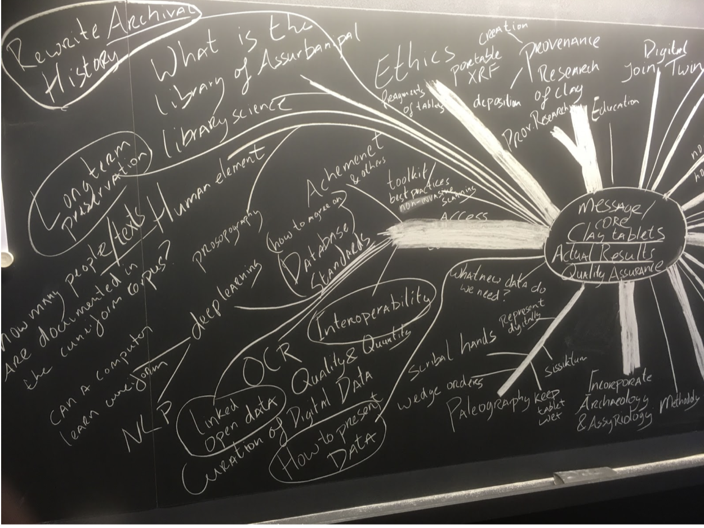
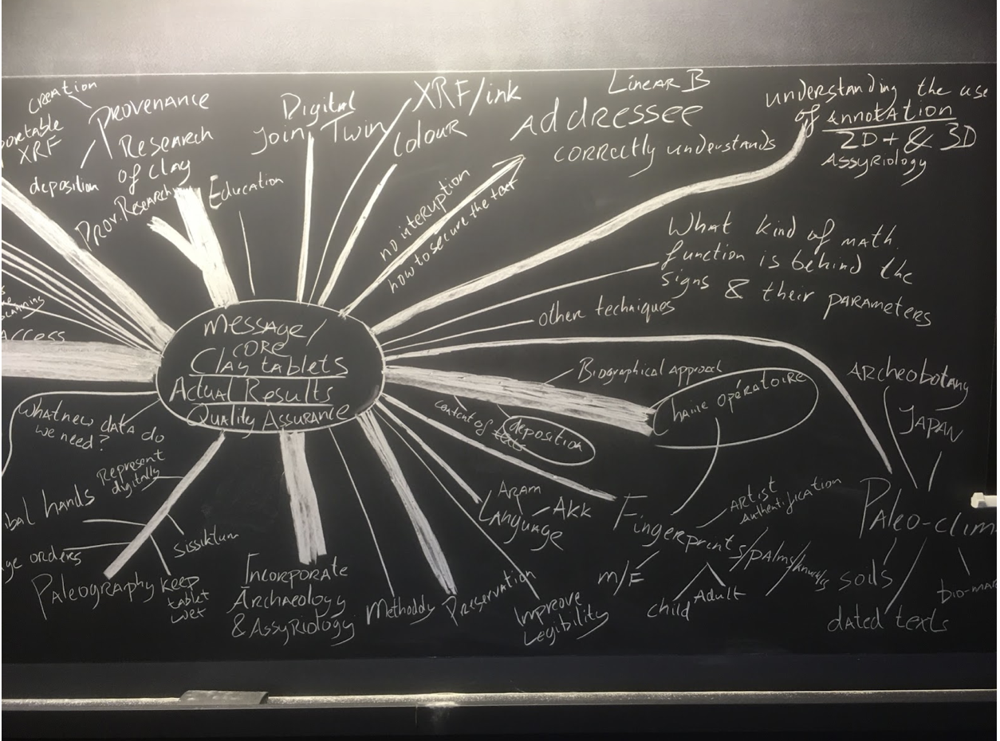

# Thursday Plenary 1

[Spreadsheet](network.tsv) of network of participants, disciplines, etc.

Mindmap

## Personal reflection

Please take 30 - 45 minutes to reflect (individually or as a team) on the following questions:

* What are your research goals?
* Which research question(s) best capture(s) the problem that you want to get solved?
* In an interdisciplinary setting, with which domains / experts would you need to work together in order to answer your research question(s)?

Please present the answers in a pitch (2-3 minutes) during the plenary session (16:30)

## Inventory of research questions

Jana Mynarova

Central Concern: **Message**

How do you transmit your message in such a way that it reaches its target without being disturbed (intact)? And in such a way that your addressee understands your message. How do you secure the text? That what you want to say is understood at the other side? How did communication work? What were the requirements for the coding and decoding the message?

Object History - link to geosciences (by means of writing we secure so that the message is not lost; we use a code, which must be learned based on other texts (schools); transmission from a text from one place to another)

Cecile Michel

How to make the many databases compatible? We need to setting up standards so that data can be exchanged. A common language to discuss the tablets.

**Ethics & Provenance**: how should we handle cuneiform tablets: how should we go about studying unprovenanced tablets? Looted materials? What are the moral consequences of taking part (as scientists) in dealing with looted tablets. 

Also ethics of destructive measuring methods. 

Biographies of texts, chaine operatoire, preservation of the tablets, curating tablets, preventing their deterioration

Hubert Mara

Extending from Jana’s proposal: what mathematical functions are behind the geometric appearance of the signs? 

What are the important parameters behind that, what defines the shape? -> age, movement

Data fusion / digital twin (with Mainz)

Computer science, geophysics, assyriology 

Ed Stratford

I want to see actual results with regard to provenance study by means of chemical analysis of clay tablets. How to separate creation provenance and deposition provenance? Kultepe texts offer the possibility to test provenance study as we know that some tablets were produced locally and others were written elsewhere.

How do tablets interact with the soil / absorb sort of the local “signature” - can you separate that from less soluble “signatures” that would give more information about where the tablets were created

data base standards -> interoperability 

* Many different database projects; making them all use exactly the same parameters might be too difficult, but a standard of interoperability might be achievable

Lucy Bennison-Chapman

_Texts as Artefacts: Exploring clay tablet production, use and deposition in ancient Mesopotamia, via the analysis of fingerprints on clay tablets_ OR_ The production of documents in the early historic period: understanding the chain operatoire, identity and authorship via the analysis of fingerprints on clay tablets_

RQ: Looking at texts as artifacts (production, deposition, use) fingerprints on tablets and envelopes (female, adult, child), do we have more than one person represented per artifact? how were documents produced? What’s the chaîne operatoire? Identity and authorship. Do the fingerprints match our expectations of who wrote the tablet, the envelope text, and sealed the tablet inside the envelope? 

Of course from the side of non-written administrative technologies interested in questions related to the continuation of these (tokens, bullae, sealings) into the Cuneiform era, especially when we have tokens and tablets from the same contexts (archives/trash pits or other). Why and how these worked together.

Incorporate archaeology (information of the site(s) the tablets were produced and uncovered in)

Collaboration with: Assyriologists, Forensic Experts (fingerprint side), geologists (shrinkage, treatments of the clay), imaging Specialists (RTI/3D scanning/CT), data specialists (presenting, visualizing and publishing data)

(See similar research on Linear B tablets)

Jon Taylor

Preservation of the objects: how can we treat them and preserve them for the future, so that we don’t interfere with future research? How can I offer my curatorial role and expertise to the research community?

Outreach: how do we improve access to documentation?

RQ: What is the library of Ashurbanipal? Tools and technology; ink; stylus; wedge order. Identify fakes? Individual scribal hands. What is a sign?

TIME: how were texts written looking at the temporal dimension

Provenance of tablets (not necessarily based on the clay)

Collaboration with: CT work, XRF, anybody doing palaeography

Dominique & co

Can we use the clay and its inclusions as a proxy of the palaeo-climate? Which bio-markers can we use? (coccolith, diatom etc) Esp. the tablets of which we know where and when they were made? Of unprovenanced tablets: we want to help find out where they come from, based on the composition of the clay. 

Looking at the geo-physics of the tablets: can we contribute to the challenge of preserving (conserving) the tablets?

Collaborate with: Specialists for the biomarkers (plants, animals), sedimentologists, working w/ the Japanese group because they look at the inclusions in the tablets, 

Need to progress: Fragments of tablets (REALLY invasive research)

* Look at boreholes at archaeological sites to reconstruct the palaeo-climate (not all research must be carried out on the tablets, we can also “delve” new data!)
* Use dates in texts

Adam Anderson:

What is the human element in producing documents?

* Prosopography
* Disambiguation of personal names
* We need to improve access to textual data and provide links between primary and secondary sources
* Who are the named entities on the sources?
* OCR (Optical Character Recognition)
* Deep learning language models for cuneiform languages
    * Data too small right now
* Linked open data

RQ: how many people are documented in the cuneiform record? Can we make inferences from that data about demographics?

Collaboration with: assyriology, computer science, NLP (natural language processing) / computational linguistics, we need to bridge the gap between assyriology - archaeology - museum studies, library science

1. Goals: (to count the human element, both in the content and production of the documents)
    1. to improve access to cuneiform tablets and textual data for research purposes (in general)
    2. to provide links between the primary and secondary sources
    3. to identify all named entities on the documents (prosopographical disambiguation)
    4. to help develop and optimize OCR for cuneiform
    5. to build DL language models for cuneiform languages
2. Questions:
    6. How many people are documented in the cuneiform record?
        1. How many cuneiform tablets exist in the world? (known / unknown…)
    7. How many publications make reference to these tablets, either directionally (with an ID) or indirectly via reference to time, place, genre, or specific entities?
    8. Can we teach a computer / AI to read cuneiform?
3. Collaboration with experts in:
    9. Assyriology
    10. CS, ML & NLP / computational linguistics
    11. Archaeology
    12. Museums
    13. Libraries
    14. Existing databases 
    15. Linked Open Data (Wikibase & Wikidata)

[Hendrik](https://docs.google.com/document/d/16s8TO-_F0ZQwX7WZBQzRilMiqovXyYCqy1tfpD2Vse0/edit?usp=sharing)

RQ1: How can traditional assyriological research benefit from annotated 2D+, 3D representation? Understanding the use of new annotation tools in Assyriology (e.g. Timo). We need to think carefully about creating extra data sets. When we do (that is OK, but) select them wisely. 

RQ2: provenance study of clay tablets with pXRF; what are specific signatures of groups of tablets? We also must be aware of the ethics of unprovenanced (looted) tablets? Creating research strategies to provide insights in that, is a task we should take up! 

Collaborations: which collections will we study? 

Mohammad

Quality and quantity of data: respect of the original tablet and use of digital methods. 

Ethics of data science: what new data do we need?

How to make our research sustainable in the future? 

Who will curate the data? 

Collaborate with: sociology, IT, long-term preservation specialists

Bruhn

Research goals: improving and/or standardizing workflows for the acquisition of 3D surfaces. 

Radiometry, colour of the clay 

We should somehow nail down what techniques are good for what purpose; generate a catalogue / toolkit / recommendation system / best practices of what technology you use for what purpose (non invasive scanning methods!)

RQ: WIth what certainty can I derive information for a RQ from digital representations of artifacts? 

Collaborations: geo-engineering, archaeology, philology

Data curation must be part of the research application as one of the work packages. Specialists of data standardization need to be part of the team.  

We need different mechanisms of how to agree on standards for data (-> this should happen for us after we have sharpened our research goals)

Timo Homburg

Paleography: how to represent palaeography, and its benefits for ML.

Which vocabularies and standards do we need for that?

Zemanek

We need good documentation (incl. preservation). 

Standardization. How do we make sure that the means we already have are actually used? Implementation of methods in the field. 

How do deviational properties pattern/cluster (very broadly), e. g. clay composition or language

Victor Klinkenberg

Biographical approach, chaine operatoire, to tablets is promising. My personal interest in the final stages of tablet use. Working on a big project on investigating depositional context with Assyriologists. Interplay is necessary between assyriology and archaeology because you can tell something about these processes from both sides. 

RQ: how do archaeological data reflect ancient practices of administration. Content and context need to be combined. 

Doris Prechel

Quality assurance: our aim is to reconstruct ancient cultures — when are we sure we understand enough of the basics. We need to get the starting point right. We need to think about methodologies. Our knowledge is scattered between sub-specializations, how do we make sure that we keep talking to each other? 

Lambert van Eijck

There are many fragments: we can scan them and assemble them back into a whole tablet. 

Jaroslav 

Cuneiform tablets are interesting for testing our methods. We would like to use this group to try and do fusion of digital models (tomography, surface analysis). Can we improve the legibility of tablets for specialists? Physical annotation (e.g. data on colour, chemical composition): this can be another layer of data that can be added to our digital objects (in addition to text annotation). 

Since we are talking about huge volumes of data, how can we distribute, store and present data to make it easier to use? Use our models to answer questions how clay was prepared prior to use as a tablet

Join Computer Tomography and other physical techniques 

Dzemila

Generalize to imprints generally, not only fingerprints, like for example brush strokes

Three questions: Are my imprints fingers, palms or knuckles (collab with forensic specialists)

Set up a repository of imprints, w Timo and Hubert

Integrated approach by hendrik, want to establish an interface software to browse between different kinds of data (2D, 3D-Scans, models generated by different methods)

Dirk: Find a set of features that can act as a signature of a tablet/fragment, so that similarity of signature is a proxy for common provenance of the real articles. That could speed up combining the scattered fragments of tablets all over the world and bring them digitally together.

