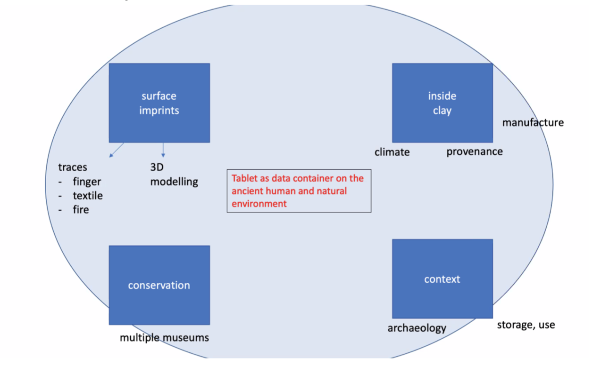

# Friday Plenary Sessions

# Session 1

_Drafting a position paper with a rough outline of a future grant proposal, translating the outcomes of days 1-2-3-4 into work packages; establishing the post- workshop agenda and responsibilities until submission of grant proposal. The organizers sketch a draft on the board based on reports of previous days and the morning session, inviting reflections on how to upgrade these ideas into concrete plans._

Cale: **cookbooks**. We need lab notebooks for cuneiform, that contain reproducible recipes that bring you from data to answers to research questions. Cookbooks are game changers.

This is a methodology consideration.

It also helps to get new technologies into the classroom, and from there on firm footing in academic research.

One institution needs to spearhead the collaboration

* There are also research networks, which might be able to fit in this position

Cookbook example for Uruk [here](https://nbviewer.org/github/Nino-cunei/uruk/blob/master/tutorial/quads.ipynb). Hebrew cookbook by a theological Ph.D student (not a computer scientist): [heads](https://nbviewer.org/github/ETCBC/lingo/blob/master/heads/getting_heads2.ipynb). (although he comes close …).

Very successful (outdated) cookbook from another field [here](https://www.gaia-gis.it/gaia-sins/spatialite-cookbook-5/index.html)

There should be someone (institution) that maintains a series of such cookbooks, producing 100-page introduction into for example the analysis of old babylonian syntax

Caroline, Kai: need a catalogue (inventory) of techniques/technologies related to the purposes they are for, with tutorial-like introductions into the same methods.

Technologies tend to be tied to specific corpora of texts. This creates difficulties. Cookbooks help to make clear which methods are known to be working for which corpora.

From Cale’s past: secret society consortium: 3 postdocs hunting for grants and sharing the booty.

(Is this the “adobe” method as Jorrit mentioned before?). So we could also make deals and for example not apply for a grant in one year to help the chances of another application going through -> not competing with each other!

Nice to have/start: Publication series at NINO or else, not for printed books but downloadable updateable books.

Erasmus MUNDUS. [https://erasmus-plus.ec.europa.eu/opportunities/organisations/cooperation-among-organisations-and-institutions/erasmus-mundus-joint-masters](https://erasmus-plus.ec.europa.eu/opportunities/organisations/cooperation-among-organisations-and-institutions/erasmus-mundus-joint-masters)

**Grants & concrete plans**

Caroline: Rieneke’s approach combined with Alfeld with enhancing the ink

* Schemes in the netherlands that would be appropriate 
* Include museums
* Supported by Hendrik

Lucy: similar size to the previously mentioned project; enhance fingerprints and connect them with the archaeological context

* Collaborate with the forensic people -> advisory position?
* possibly well received by the public -> outreach!
* Cale: connect with clay sourcing, also involve the big corpora (Ur III, Old Assyrian, Neo-Assyrian and Neo-Babylonian)
* Possibly later on also focus on fingerprints on object with proto-cuneiform
* Overturn a possibly false simplistic impression of technologies of writing
* Linked to palaeography and gender
* Important to distinguish textile and finger impressions
* Fingerprints as a benchmark for 3D-scanning (can they capture these details?)
* Test textual details against reality (e. g. who applied seals?)

Dominique:

* For XRF-technology: establishing of reference materials for the analysis of clay

Hendrik: we have to look for datasets that reside with other groups, not necessarily in this consortium.

Can we find a good methodology to bring together the dispersed tablets and fragments from all over the world?

Cale: e.g. if we have a recipe to determine the clay source, then it could engage also the smaller museums to analyze their holdings in this way.

Dzemila:

* I need help to standardize the database of pictures of fingerprints I will create for my project with the Rijksmuseum next year

(try Susan Schreibman and Costas Papadopoulos, Maastricht University. Also see Remaking Material Culture on [dariah-teach](https://teach.dariah.eu/course/view.php?id=55).) 

Kai: Provenience versus provenance.

Rients: Tablet as a **Databomb** (Datatreasure), with information contained with in, inscribed upon and formed around

Dirk: tablet as **lens**, like a gravity lens in astronomy: one galaxy bends the light and acts as a lens to see further galaxies sharper. Also: new techniques see _through_ the clay. And more metaphorically, through the clay we see the context of the tablets.

Caroline:

**~ Tablet as data container on the ancient human and natural environment ~**

* Four different research cells (silos) that continually exchange insights and further questions
        * Surface imprints
        * Inside of the clay
        * Conservation
        * Context
    * Involving a big museum -> possible with BM? Or problematic especially w/ the ERC?

Caroline: is this consortium poised to generate new knowledge? 

Jon: a museum has a research agenda and strategy, focused on collections, it does very technical things, also apart from exhibitions. Research questions from the museum perspective are more concrete/specific.

Move on with the big ERC and the smaller “adobe” applications.

# Session 2 

_Formulating the nature, aims and strengths of our consortium; defining our common ground and the areas of mutual advancement; identifying sub-projects and sub-teams; critically evaluating the viability of "ancient data security" as an overarching theme of the consortium._

Go to the [Sticky Notes](https://miro.com/welcomeonboard/aEl1Qmdaa2hFZ1l1YkNQeUNyd0Z1a3lOVHd0S2hlWXhXOFZ5Zkp3eWxlUnNhYThGbmxMWnlONDNLQlNmd3NudHwzNDU4NzY0NTIwMDc3MDM1NjE1?invite_link_id=643118846629)! (hm, or rather not). Swap sessions 2 and 1 in this document? Done!Thx!

Jana

Czech science foundation project

We need to deal more with the collection at the national museum at Prague

Interested in Twinning

Really liked the ideas to connect research and teaching

Application for the JPICH

* Michela, Jana, Hendrik, Dominik, Rients

COST

[https://www.cost.eu/about/members/](https://www.cost.eu/about/members/)

[https://www.cost.eu/cost-action/europe-through-textiles-network-for-an-integrated-and-interdisciplinary-humanities/](https://www.cost.eu/cost-action/europe-through-textiles-network-for-an-integrated-and-interdisciplinary-humanities/)

[https://euroweb.uw.edu.pl/](https://euroweb.uw.edu.pl/) 

* No money for dedicated researchers, but money for administrators and can reimburse travel and accomodation cost

Prechel: Possibility for a lower-effort travel and meeting grant possible through the DFG

[https://www.dfg.de/foerderung/programme/einzelfoerderung/wissenschaftliche_netzwerke/](https://www.dfg.de/foerderung/programme/einzelfoerderung/wissenschaftliche_netzwerke/)

Research data management

[https://sshopencloud.eu/](https://sshopencloud.eu/)

[http://www.e-rihs.eu/](http://www.e-rihs.eu/)

* Mission statement as a basis for the topics of the consortium and for further meetings
    * Caroline writes a first draft (**Deadline: Mid-April**) 

Date for the next meeting: 19. April 17:00 CET on Zoom 

