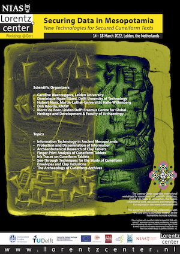

# lorentz2022

Proceedings of the Lorentz Workshop:
[Securing Data in Mesopotamia](https://www.lorentzcenter.nl/securing-data-in-mesopotamia-new-technologies-for-secured-cuneiform-texts.html).

Program: [pdf](https://www.lorentzcenter.nl/index.php?pntType=ConPagina&id=1567&conPaginaProgrammaDagId=158&pntHandler=DownloadAction).

Report: [markdown](report/scientificReport.md)

The workshop was held in 2022, March 14-18, at the Lorentz CenterLeiden, NL.

